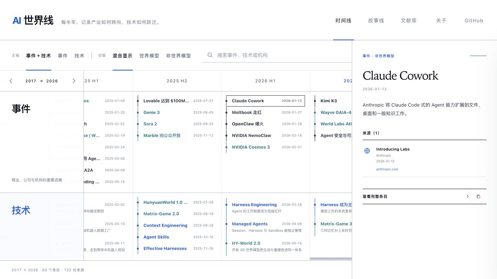

# AI 世界线

**一张解释现代 AI 为什么会走到今天的、以原始来源为基础的地图。**

[English](./README.md) · [在线阅读](https://aprilwang2024.github.io/ai-worldline/) · [阅读故事线](https://aprilwang2024.github.io/ai-worldline/#stories) · [查看数据](./data/timeline.json) · [建议新条目](../../issues/new?template=add-event.yml)



AI 世界线按半年整理现代 AI 的演进，并把经常混在一起的两类问题分开：

- **事件**：公司、机构、产品发布与改变市场方向的时刻；
- **技术**：论文、架构、研究路线与开源社区带来的能力跃迁。

公开时间线只保留一个明确的横向切面：**世界模型 / 非世界模型**。三条编辑策展的故事线进一步把关键节点连接成因果路径。每个条目都回答“发生了什么 / 为什么重要 / 改变了什么”，并尽量回到论文全文、代码仓库和机构官方发布。

## 它有什么不同

这不是一份新闻聚合，也不是把论文不断堆长的 Awesome List，而是一份可追溯的研究索引：

- 每个条目至少有一份可归属的来源；
- 优先使用论文、全文、代码与机构官方发布；
- 事实和解释分层呈现；
- 专题筛选不会被误画成一条独立、封闭的历史；
- 世界模型可以被单独观察，但不会被误画成一条独立主轴；
- 故事线复用已有事件，解释阶段变化而不是增加新闻数量；
- 尚未完成的半年可以标记为 `watching`，不把短期热度过早写成结论。

当前档案覆盖 **2017—2026**，包含 **93 个条目**、**132 份去重来源**和 **3 条故事线**。其中世界模型切面有 **34 个条目**，覆盖模型式强化学习、预测表征、可交互生成、具身智能、自动驾驶与空间智能。

## 本地运行

网站是无运行时依赖的静态页面：

```bash
python3 -m http.server 8808
```

然后访问 `http://127.0.0.1:8808/`。也可以直接打开 `index.html`；只有修改数据时才需要 Node.js。

## 贡献一个事件

权威数据源是 [`data/timeline.json`](./data/timeline.json)，`timeline-data.js` 只是为了兼容浏览器直接打开而生成的文件。

```bash
npm run validate
npm run build:data
npm test
```

自动检查会识别重复 ID、错误的半年与分类、非法日期、缺少解释、错误链接格式以及没有来源的条目。完整流程见 [`CONTRIBUTING.md`](./CONTRIBUTING.md)。

如果不想编辑 JSON，也可以使用结构化的[新增事件表单](../../issues/new?template=add-event.yml)或[事实纠错表单](../../issues/new?template=correction.yml)。

## 项目结构

```text
data/timeline.json       权威时间线、切面与故事线数据
data/schema.json         编辑器可识别的 JSON Schema
scripts/                 数据验证与生成脚本
timeline-data.js         生成的浏览器数据文件
app.js                   筛选、故事线、搜索、永久链接与详情交互
styles.css               视觉系统与响应式布局
.github/                 CI、Pages 部署和贡献表单
```

## 编辑原则

这是一份经过选择的地图，不宣称收录完整 AI 历史。纳入标准、来源层级、纠错政策以及事实与解释的边界记录在 [`EDITORIAL_POLICY.md`](./EDITORIAL_POLICY.md)。世界模型专题的研究账本位于 [`report-source.md`](./report-source.md)。

## 许可

代码使用 [MIT License](./LICENSE)；时间线数据、摘要与编辑内容使用 [CC BY 4.0](./LICENSE-CONTENT.md)。被引用论文、代码与官方发布的权利仍归各自作者和发布机构所有。
