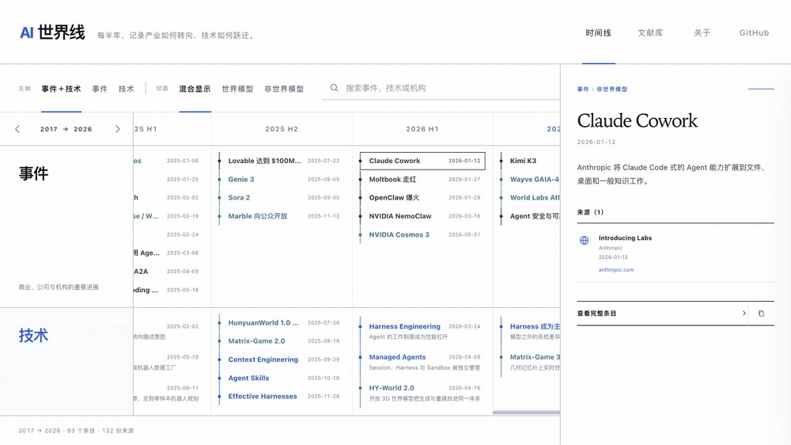

# AI 世界线

**基础模型、智能体与世界模型的演进图谱。**

[中英双语概览](./README.md) · [English](./README.en.md) · [在线阅读](https://aprilwang2024.github.io/ai-worldline/) · [查看数据](./data/timeline.json) · [建议新条目](../../issues/new?template=add-event.yml)



AI 世界线按半年整理基础模型时代的演进，并把经常混在一起的两类问题分开：

- **事件**：公司、机构、产品发布与改变市场方向的时刻；
- **技术**：论文、架构、研究路线与开源社区带来的能力跃迁。

公开时间线只保留一个明确的横向切面：**世界模型 / 非世界模型**。每个条目都回答“发生了什么 / 为什么重要 / 改变了什么”，并尽量回到论文全文、代码仓库和机构官方发布。

## 它有什么不同

这不是一份新闻聚合，也不是把论文不断堆长的 Awesome List，而是一份可追溯的研究索引：

- 每个条目至少有一份可归属的来源；
- 优先使用论文、全文、代码与机构官方发布；
- 事实和解释分层呈现；
- 专题筛选不会被误画成一条独立、封闭的历史；
- 世界模型可以被单独观察，但不会被误画成一条独立主轴；
- 尚未完成的半年可以标记为 `watching`，不把短期热度过早写成结论。

当前档案覆盖 **2017—2026**，包含 **93 个条目**和 **132 份去重来源**。其中世界模型切面有 **34 个条目**，覆盖模型式强化学习、预测表征、可交互生成、具身智能、自动驾驶与空间智能。

## 站内 AI 问答

站内 AI 助手「**伽利略**」平时是一个可拖动的圆形按钮，吸附在页面左右上下边缘（位置自动记忆），点击后从按钮所在方位丝滑展开为对话框。它会依据**整条世界线的文本知识**（页面内已加载的全部条目）以及**你当前正在查看的页面**（所在路由、筛选切面、选中的条目）来回答提问；选中页面里的任意文字后**右键选择「让伽利略讨论这段内容」**即可把片段发给它，条目面板也有一键追问入口。

**星空**：导航中的「星空」是伽利略的 AI 画布。选择一个兴趣视角（如「模型参数」「算力基础设施演进」「AI 研究者们的爱恨情仇」），伽利略会把整条世界线重新组织成一张知识图谱，在暗夜星空里以动画徐徐展开；点击任意星点可让伽利略持续向外扩展，无限延伸。

对话通过任意 OpenAI 兼容的 Chat Completions 接口完成，配置方式二选一：

- **本地实测**：`CHAT_API_KEY=你的密钥 npm run preview`，打开 `http://127.0.0.1:8808/` 即开箱即用——预览服务自带同源转发代理，密钥只在本机进程内，不会写入仓库或暴露给浏览器（默认上游为阿里云编码套餐网关 `coding.dashscope.aliyuncs.com` + `glm-5`，可用 `CHAT_MODEL` / `CHAT_UPSTREAM` 覆盖）；
- **站点维护者**：在 [`chat-config.js`](./chat-config.js) 中预填 `endpoint` 与 `model`（若自建了持有密钥的转发代理，例如部署在已有服务器上的转发端点，也可一并内置密钥）；
- **访客**：点对话框右上角 ⚙ 填入自己的端点、模型名与 API 密钥，密钥只保存在访客浏览器本地，不经过本站服务器。

## 自动更新

自动更新管线**已实现**（抓取 → 去重打分 → LLM 起草 → Draft PR 人工审校）：

```bash
npm run collect   # 抓取 watchlist 来源（arXiv / HuggingFace / 实验室官方博客 / GitHub releases）
npm run dedupe    # 对照既有条目去重并按相关性打分
LLM_API_KEY=sk-xxx npm run draft   # LLM 起草候选条目（来源 URL 防编造校验）
```

CI（`update-watch.yml`）每日定时运行并自动开 Draft PR，条目一律 `watching` 状态、经人工审校后方可合并。架构与护栏见 [`docs/auto-update-roadmap.md`](./docs/auto-update-roadmap.md)。

## 本地运行

网站是无运行时依赖的静态页面：

```bash
python3 -m http.server 8808
```

然后访问 `http://127.0.0.1:8808/`。也可以直接打开 `index.html`；只有修改数据时才需要 Node.js。

## 贡献一个事件

权威数据源是 [`data/timeline.json`](./data/timeline.json)，`timeline-data.js` 只是为了兼容浏览器直接打开而生成的文件。

```bash
npm run validate
npm run build:data
npm test
```

自动检查会识别重复 ID、错误的半年与分类、非法日期、缺少解释、错误链接格式以及没有来源的条目。完整流程见 [`CONTRIBUTING.md`](./CONTRIBUTING.md)。

如果不想编辑 JSON，也可以使用结构化的[新增事件表单](../../issues/new?template=add-event.yml)或[事实纠错表单](../../issues/new?template=correction.yml)。

## 项目结构

```text
data/timeline.json       权威时间线与切面数据
data/schema.json         编辑器可识别的 JSON Schema
scripts/                 数据验证与生成脚本
timeline-data.js         生成的浏览器数据文件
app.js                   筛选、搜索、永久链接与详情交互
chat-config.js           站内 AI 问答的端点与模型配置
chat-widget.js           站内 AI 问答对话框
styles.css               视觉系统与响应式布局
docs/                    规划与设计文档
.github/                 CI、Pages 部署和贡献表单
```

## 编辑原则

这是一份经过选择的地图，不宣称收录完整 AI 历史。纳入标准、来源层级、纠错政策以及事实与解释的边界记录在 [`EDITORIAL_POLICY.md`](./EDITORIAL_POLICY.md)。世界模型专题的研究账本位于 [`report-source.md`](./report-source.md)。

## 许可

代码使用 [MIT License](./LICENSE)；时间线数据、摘要与编辑内容使用 [CC BY 4.0](./LICENSE-CONTENT.md)。被引用论文、代码与官方发布的权利仍归各自作者和发布机构所有。
